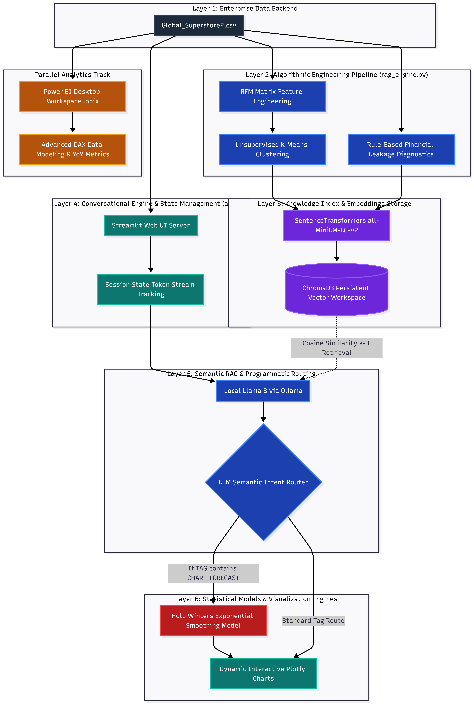

# AI-Powered Business Intelligence Platform (Predictive RAG & Dashboard Ecosystem)

An enterprise-ready business intelligence (BI) and decision-support platform designed to bridge the gap between advanced analytical pipelines and executive strategy. This ecosystem integrates a localized **Generative AI RAG Copilot** with **Predictive Analytics** and traditional **Corporate Reporting (Power BI)** to transform raw, global retail transactional data into automated, data-driven revenue growth strategies.

---

## ⚙️ The Technology Stack

- **Conversational Orchestration:** Local Llama 3 via Ollama  
- **Vector Search Engine (RAG):** ChromaDB Persistent Workspace  
- **Text Embedding Engine:** Hugging Face `SentenceTransformers` (`all-MiniLM-L6-v2`)  
- **Predictive Modeling:** Triple Exponential Smoothing (Holt-Winters Model) via `statsmodels`  
- **Unsupervised Machine Learning:** K-Means Clustering via `scikit-learn`  
- **Interactive Web UI:** Streamlit Framework  
- **Data Visualization & Analytics:** Plotly Express & Power BI Desktop  

---


## 🚀 Core Platform Features

1. **Conversational BI (RAG Architecture):** Uses an specialized indexing pipeline to convert raw transactions into dense structural facts. Executives can chat directly with corporate data using natural language, with a localized LLM-router programmatically parsing query intent to trigger tailored visualization scripts.
2. **Unsupervised Customer Segmentation:** Extracts an advanced Recency, Frequency, and Monetary (RFM) behavioral feature space per account, utilizing a normalized scalar transformation to segment the customer base into distinct risk and value populations.
3. **ML-Powered Trend & Revenue Forecasting:** Implements statistical time-series forecasting to model historical monthly seasonality and extrapolate a 6-month predictive revenue line.
4. **Enterprise Power BI Reporting:** A parallel interactive dashboard tracking key operational workflows, built with advanced relational DAX matrices to monitor margins, Year-over-Year (YoY) growth, and regional profit leakage.

---

## 📊 Model Evaluation & Data Science Diagnostics

This platform implements rigorous mathematical validation to ensure data-driven integrity and guard against LLM hallucinations.

### 1. Customer Segmentation Validation (K-Means)
- **Silhouette Score:** `0.3220`  
  *Validation:* A positive Silhouette index confirms that the unsupervised clusters are mathematically distinct, structural, and well-separated despite the naturally continuous and noisy properties of retail transaction data.
- **Cluster Demographics:**
  - `Cluster 0`: At-Risk / Hibernating Accounts (324 clients)
  - `Cluster 1`: High-Volume Strategic Champions (86 clients) — *Target VIP Audience*
  - `Cluster 2`: Loyal Core Buyers (385 clients)

### 2. Time-Series Revenue Forecasting Validation (Holt-Winters)
- **Mean Absolute Percentage Error (MAPE):** `13.40%`  
  *Validation:* Delivering an average forecasting accuracy of **86.60%** on an out-of-time chronological testing split. Any error boundary under 15% is considered optimal for corporate inventory and budget planning.
- **Validation Model RMSE:** `$74,902.65`

---

## 📈 Dashboard Interactivity

### Python Streamlit Application
The conversational UI renders real-time data dynamically. When an AI response is generated, it appends custom formatting tags (`[CHART_REGION]`, `[CHART_FORECAST]`, etc.) to embed Plotly charts seamlessly into the chat container.

### Power BI Desktop Integration (`dashboard/`)
To complement the conversational AI, the Power BI suite tracks high-level operational workflows:
- **Advanced DAX Metrics:** Year-over-Year (YoY) growth lines, profit-margin tracking, and running cumulative sales.
- **Dimensional Cross-Filtering:** Interactive global slicers across geographic regions, product market categories, and distribution segments.


---

## 📂 Repository Structure

```text
├── data/
│   └── Global_Superstore2.csv      # Source transactional dataset
├── dashboard/
│   └── Global_Superstore_BI.pbix  # Interactive Power BI Binary File
├── media/
│   ├── architecture.png            # Mermaid.live pipeline diagram
│   └── powerbi_screenshot.png      # Power BI report capture
├── app.py                          # Stateful Streamlit application UI
├── rag_engine.py                   # Data indexing, RFM scaling, and ChromaDB pipeline
├── evaluate_models.py              # Script computing Silhouette, MAPE, and RMSE scores
├── requirements.txt                # Production environment dependencies
└── README.md                       # Comprehensive project documentation
